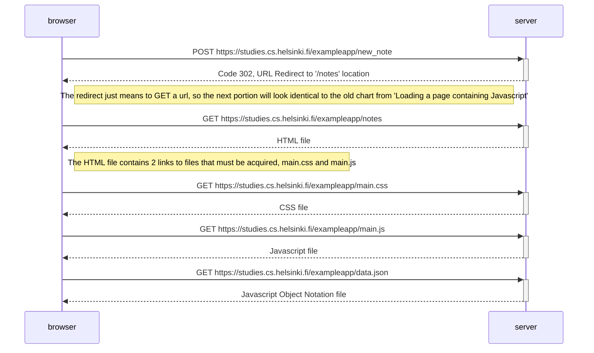

# UoH-part-0
Exercises for the fullstack course on University of Helsinki

Section 0.4 New Note Diagram

```mermaid
sequenceDiagram
  participant browser
  participant server
  
  browser->>+server: POST https://studies.cs.helsinki.fi/exampleapp/new_note
  server-->>-browser: Code 302, URL Redirect to '/notes' location
  note right of browser: The redirect just means to GET a url, so the next portion will look identical to the old chart from 'Loading a page containing Javascript'
  browser->>+server: GET  https://studies.cs.helsinki.fi/exampleapp/notes
  server-->>-browser: HTML file
  note right of browser: The HTML file contains 2 links to files that must be acquired, main.css and main.js
  browser->>+server: GET https://studies.cs.helsinki.fi/exampleapp/main.css
  server-->>-browser: CSS file
  browser->>+server: GET https://studies.cs.helsinki.fi/exampleapp/main.js
  server-->>-browser: Javascript file
  browser->>+server: GET https://studies.cs.helsinki.fi/exampleapp/data.json
  server-->>-browser: Javascript Object Notation file
```
