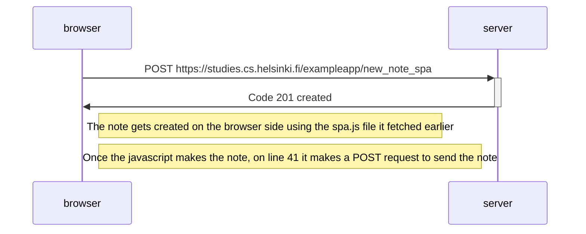

Exercises for the fullstack course on University of Helsinki

Section 0.6 Single Page App Diagram

```mermaid
sequenceDiagram
  participant browser
  participant server
  
  browser->>+server: POST https://studies.cs.helsinki.fi/exampleapp/new_note_spa
  server->>-browser: Code 201 created
  note right of browser: The note gets created on the browser side using the spa.js file it fetched earlier
  note right of browser: Once the javascript makes the note, on line 41 it makes a POST request to send the note
  
```
