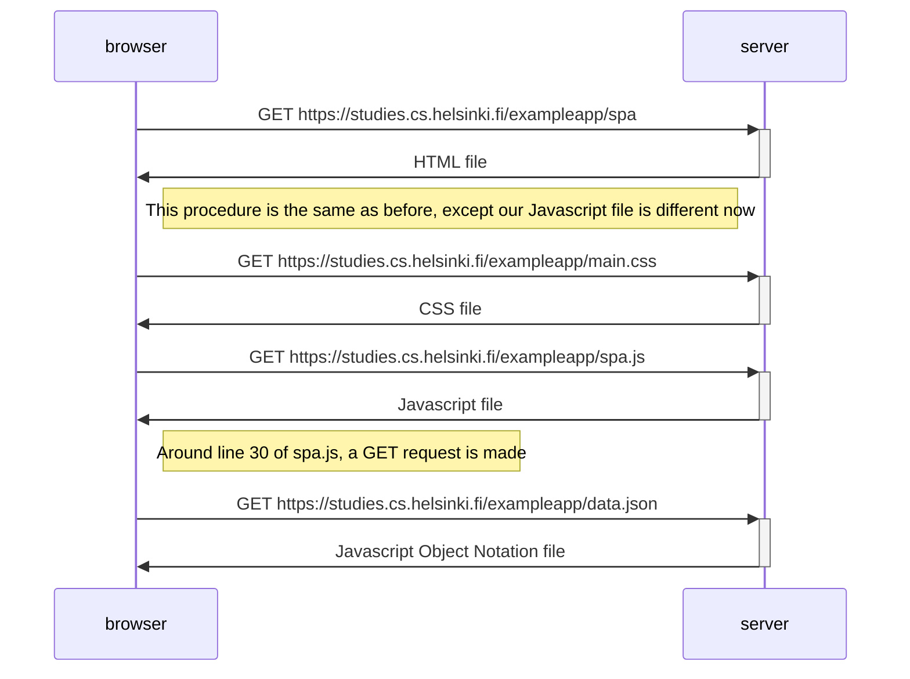

# UoH-part-0
Exercises for the fullstack course on University of Helsinki

```mermaid
sequenceDiagram
  participant browser
  participant server
  
  browser->>+server: GET https://studies.cs.helsinki.fi/exampleapp/spa
  server->>-browser: HTML file
  note right of browser: This procedure is the same as before, except our Javascript file is different now
  browser->>+server: GET https://studies.cs.helsinki.fi/exampleapp/main.css
  server->>-browser: CSS file
  browser->>+server: GET https://studies.cs.helsinki.fi/exampleapp/spa.js
  server->>-browser: Javascript file
  note right of browser: Around line 30 of spa.js, a GET request is made
  browser->>+server: GET https://studies.cs.helsinki.fi/exampleapp/data.json
  server->>-browser: Javascript Object Notation file
```
